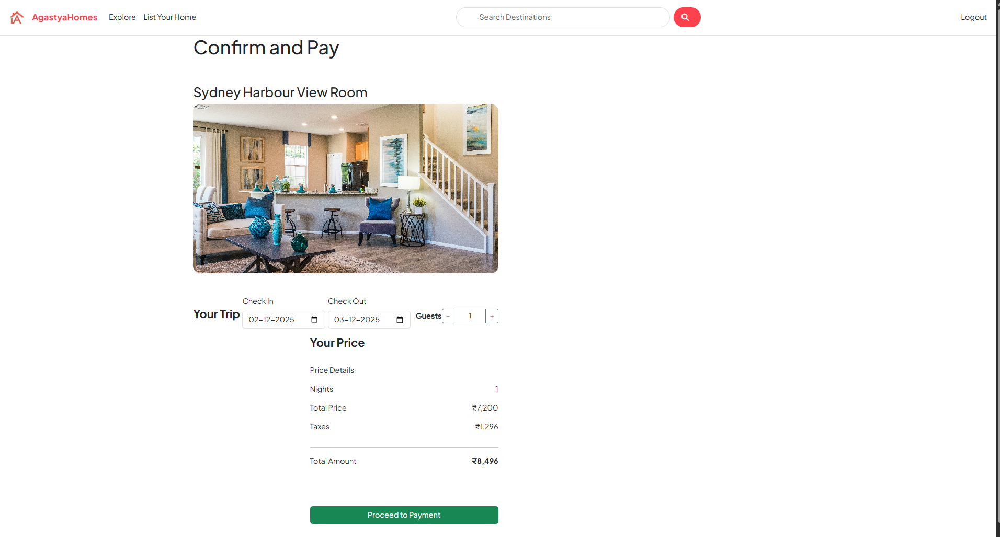

# 🏡 AgastyaHomes

A modern, full-stack real-estate booking web application where users can explore destinations, list properties, manage bookings, and post reviews.  
Built with **Node.js**, **Express**, **MongoDB**, and **EJS**, this project delivers real-world functionality similar to top property-rental platforms.

🌐 **Live Demo:** https://agastyahomes.onrender.com

---

# 📸 Project Screenshots

### 🏙️ Listings Page


### 📄 Listing Details Page


### ⭐ Reviews Page


### 💳 Checkout Page


### ➕ Create New Listing


---

# ✨ Features

### 🔐 **User Authentication**
- Secure login & signup using Passport.js  
- Protected routes for verified users only  

### 🏠 **Listing Management**
- Create, update, delete property listings  
- Upload images (Cloudinary or local)  
- Category-wise filtering (Rooms, Mountains, Iconic Cities, Domes, etc.)

### ⭐ **Reviews System**
- Users can post & delete reviews  
- Average rating and review count included  

### 🗃️ **Database & Validation**
- MongoDB + Mongoose ODM  
- Joi validation for secure & clean inputs  

### 🛡️ **Error Handling**
- Custom ExpressError class  
- Global error middleware  
- Async error wrapper (wrapAsync)

### 🔄 **Cascade Deletes**
- When a listing is removed → all related reviews auto-deleted  

---

# 🛠️ Tech Stack

### **Backend**
- Node.js  
- Express.js  

### **Database**
- MongoDB  
- Mongoose ORM  

### **Templating**
- EJS  
- EJS-Mate (Layouts & Partials)

### **Security & Auth**
- Passport.js  
- Passport-Local  
- Express-Session  
- Connect-Flash  

### **Utilities**
- Method-Override  
- Joi Validation  

---

## 🚀 Getting Started

### Prerequisites

  * Node.js installed
  * MongoDB installed and running

### Installation & Setup

1.  **Clone the repository:**

    ```bash
    git clone https://github.com/your-username/AgastyaHomes.git
    cd AgastyaHomes
    ```

2.  **Install dependencies:**

    ```bash
    npm install
    ```

3.  **Set up your environment variables:**
    Create a `.env` file in the root directory and add your MongoDB connection string:

    ```
    MONGO_URL="your_mongodb_connection_string"
    ```

4.  **Run the application:**

    ```bash
    node app.js
    ```

    The server should now be running on the configured port.

-----

## ⚙️ Core Concepts

### Authentication & Sessions

User authentication is handled by **Passport.js** using the local strategy. The `passport-local-mongoose` plugin simplifies the User model by adding methods for password hashing and user registration.

Sessions are managed with `express-session`, allowing user state to persist across requests. The `connect-flash` middleware is used to display temporary messages to the user (e.g., "Login successful" or "You must be logged in to do that"). The `isLoggedIn` middleware function protects routes by verifying `req.isAuthenticated()`.

### Validation

To ensure data integrity, all incoming request bodies for new listings and reviews are validated against pre-defined schemas using **Joi**. If validation fails, an error is thrown and handled gracefully.

### Database Schema

  * **User Model**: Stores user credentials (`username`, hashed `password`) and `email`. Handled largely by `passport-local-mongoose`.
  * **Listing Model**: Contains core listing information like `title`, `description`, `price`, `location`, etc. It also includes an array of `ObjectID`s, referencing the **Review** documents associated with it.
  * **Relationship**: When a listing is deleted, a Mongoose `post` middleware hook is triggered to perform a cascade delete, removing all of its associated reviews from the database.

### Error Handling

The application uses a centralized error handling strategy:

1.  **`ExpressError`**: A custom error class that extends the native `Error` object to include an HTTP `statusCode`.
2.  **`wrapAsync` Utility**: A higher-order function that wraps asynchronous route handlers. It catches any promise rejections and passes them to Express's `next()` function, eliminating the need for repetitive `try...catch` blocks.
3.  **Error Handling Middleware**: A final middleware in `app.js` catches all errors passed to `next()`, and renders a dedicated error page with the error's message and status code.
-----

